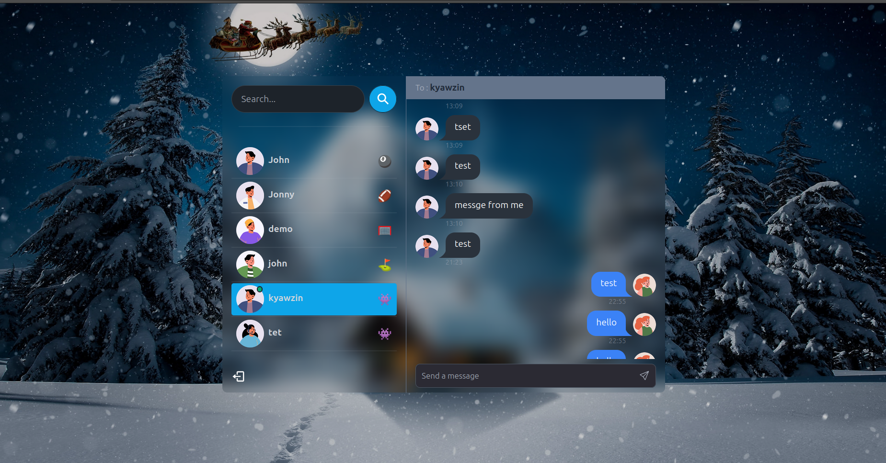

# FullStack Real Time Messaging applicatoin with MERN Stack 
This is a real-time chat application built with the MERN stack (MongoDB, Express, React, Node.js) and integrated with Socket.IO for WebSocket functionality. The app allows users to create an account, log in, and chat with other users in real-time.

## Features

- **Real-time Messaging**: Instant communication between users using WebSockets (Socket.IO).
- **User Authentication**: Secure sign-up and login using JWT (JSON Web Tokens).
- **Responsive Design**: The application is fully responsive, ensuring a seamless experience on mobile, tablet, and desktop devices.
- **RESTful API**: Backend API built with Node.js and Express for handling user management, authentication, and message storage.
- **MongoDB Database**: Data storage using MongoDB for messages, user accounts, and chat rooms.
- **Message Notifications**: Notify users when they receive a message.
- **Real-time Updates**: Automatically update the chat interface when a new message is received or sent.

## Technologies Used

- **MongoDB**: Database for storing user accounts, chat rooms, and messages.
- **Express**: Backend framework for handling API requests and serving the frontend.
- **React**: Frontend library for building the user interface.
- **Node.js**: Backend runtime environment.
- **Socket.IO**: Library for real-time, bidirectional communication between clients and servers.
- **JWT (JSON Web Token)**: Used for secure authentication.
- **Tailwind CSS**: For responsive and utility-first CSS styling.




1. **Clone the repository:**

``` bash
  git clone https://github.com/kyawzinkoko-dev/mern-stack-chat-app
  cd mern-stack-chat-app
  npm install
```
2.For backend 
``` bash
  cd backend
  npm install
  npm run dev
```
3.For fronend 
```bash
cd ..
cd frontend
npm install
npm run dev
```
4.Then navigate to `` http://localhost:3000``
